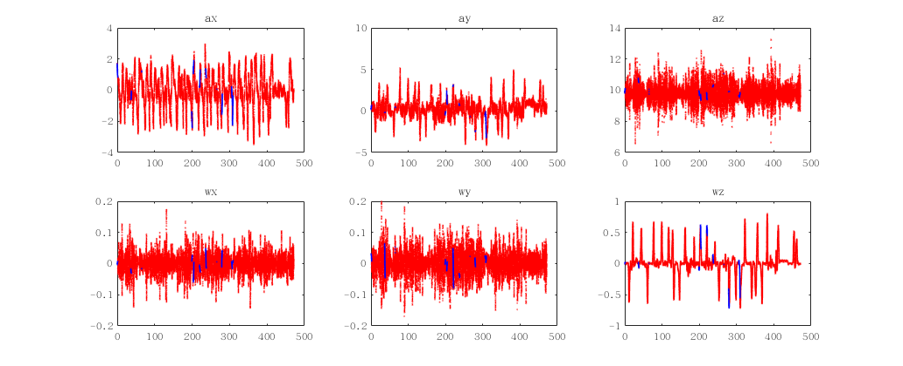
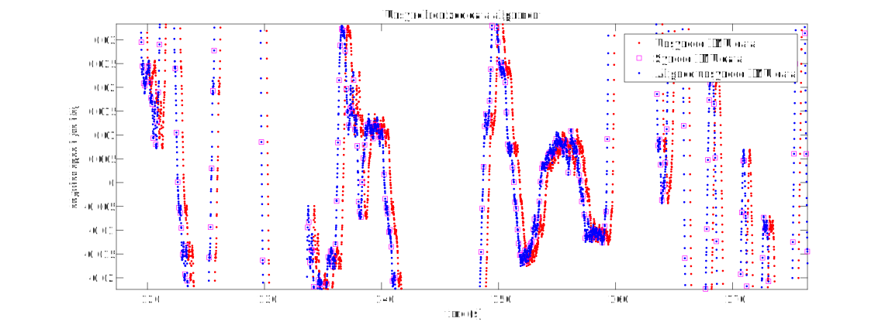
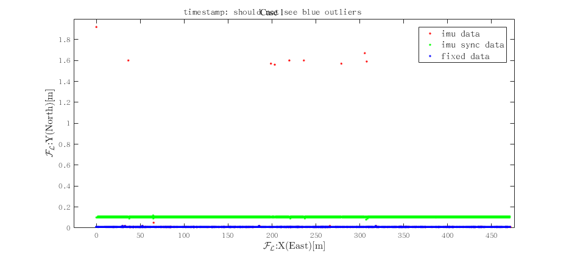

# A Interpolation and Noise Tool for KITTI Raw Data

This tool

- Interpolate and re-sync IMU data to give KITTI a 100 Hz IMU and GNSS data and correct the timestamps with vision image.

- Allow user to add noise and bias to GNSS data in given area.

The main entrance is  `ProcessKITTI.m`. 

credits: [Gong Zheng](https://github.com/gauxonz) , [Ji Xingwu](https://github.com/jixingwu)

## Input

This tool uses vision image along with its timestamps from **synced+rectified data**(like [this](https://s3.eu-central-1.amazonaws.com/avg-kitti/raw_data/2011_10_03_drive_0027/2011_10_03_drive_0027_sync.zip)), then align, interpolate and noise the IMU and GNSS data form the **unsynced+unrectified data**(like [this](https://s3.eu-central-1.amazonaws.com/avg-kitti/raw_data/2011_10_03_drive_0027/2011_10_03_drive_0027_extract.zip)).  Therefore, the tool require two folders contain these two set of data, please make your KITTI folder organized like:

`<KITTI_Folder>`  
├──  `<Synced_RawData_Folder>`  
│   └── `<Set_Folder>`  
│       	└── `<SubSet_Folder>`  
└──  `<UnSynced_RawData_Folder>`  
    └── `<Set_Folder>`  
       	└── `<SubSet_Folder>`

These paths can be changed in `ProcessKITTI.m `and `ReadData.m`.

For example, on my system,

/media/joey/dataset/KITTI		#`<KITTI_Folder>`  
├── RawData							 #`<Synced_RawData_Folder>`  
│   ├── 2011_09_26  
│   └── 2011_10_03					#`<Set_Folder>`  
│       	├── 2011_10_03_drive_0027_sync	#`<SubSet_Folder>`  
│       	├── 2011_10_03_drive_0034_sync  
│       	├── 2011_10_03_drive_0042_sync  
│       	├── 2011_10_03_drive_0047_sync  
│       	├── 2011_10_03_drive_0058_sync  
│       	├── calib_cam_to_cam.txt  
│       	├── calib_imu_to_velo.txt  
│       	└── calib_velo_to_cam.txt  
└── RawDataUnsync			# `<UnSynced_RawData_Folder>`  
    ├── 2011_09_26  
	└── 2011_10_03  
        	├── 2011_10_03_drive_0027_extract  
        	├── calib_cam_to_cam.txt  
        	├── calib_imu_to_velo.txt  
        	├── calib.mat  
        	└── calib_velo_to_cam.txt

## Output

This tool will create a path called `RawDataFixed `under `<KITTI_Folder>`, with the regular KITTI set name and sub set name. The OXTS data ( which contain IMU and GNSS) is written 3 times in to three folders: `oxts-fixed`,`oxts-interped`and `oxts-noised`. 

- `oxts-fixed`: oxts data with timestamps and IMU data interpolated. Rest of the data is filled with `NaN`.
- `oxts-interped`: oxts data with timestamps, IMU and GNSS data interpolated.
- `oxts-noised`: oxts data with timestamps, IMU and GNSS data interpolated. Extra artificial noise is add to GNSS.

**You should copy the image data (image_00 and image_01) from the synced data set manually .**

## Processing 

### Read data

In `ReadData.m`.

Due to the KITTI's file arrangement, the reading (as well as writing) can be really slow, so be patient.

### Interpolate IMU data

In `InterpImu.m`.

The result will show four pics. Please first do a visual check on the interpolation results on all IMU data: the blue, interpolated dots should be "reasonable".

and then visual check on the time alignment: the square, synced IMU data should overlapped with the blue, aligned unsynchronized IMU data.

Next, do another visual check on the time interpolation: there should be no outliers and negative values on the fixed data (blue point).

### Interpolate and noise GNSS data

In `InterpAndNoiseGnss.m`.

Please tweak the parameters on the top of `InterpAndNoiseGnss.m`.

The important parameters are:

-  `regular_std_level`,`regular_bias`: region not in `bad_gnss_area` or `good_gnss_area` will use this pair of parameters.

- `bad_gnss_area` ,`good_gnss_area`: define the good and bad regions. Column definitions: [ x[m]	y[m]    z[m]  radii[m]  white-noise-level[m] multipath-bias-level[m]  ]. The x-y-z here is under local ENU, you can determine it on the given figure after the first run.
- `grid_size`,`c1`,`c2`: parameters for Gaussian random field (special bias simulating multipath ). `grid_size` is the 'resolution' of the field and `c1`,`c2` are the correlation parameters. To simulate a field changes ever 0.2 meters with 10 meters correlation, set to `0.2,10,10` for example.

- `time_corr`: Gaussian-Markov process correlation parameter. 

- `MultipathDetectCo`: Multipath detection coefficient. Simulating the receiver's over-confidence on multipath detection failure. 

Turn on `plot_GRF` to show the GRF under the trajectory.

Please do visual check on the noise result (blue). The red circle is the bad gnss area.

### Write data out to disk

In `WriteData.m`.

Very, very slow. Please turn off `write_fix` and `write_interp` if generating different cases for the same subset to avoid re-writing.

